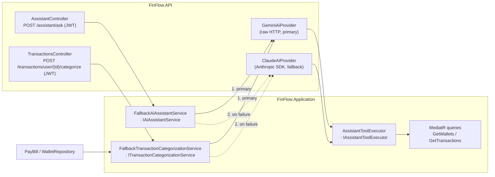

# FinFlow – End-to-End Fintech Case Study


**FinFlow** is a fintech playground that showcases clean architecture, reliable payments, and a clear developer experience.

---

## Live Demo
- **App:** https://finflow-swart.vercel.app
- **Stripe test data:** https://docs.stripe.com/testing

⚠️ Use mock data only. Do not use real payment information.

---

## Tech Stack
- **Backend:** .NET 9 Web API, Clean Architecture, MediatR, FluentValidation
- **Frontend:** Next.js 14, Tailwind CSS, shadcn/ui
- **Database:** PostgreSQL with EF Core
- **Payments:** Stripe (Checkout + Webhooks)
- **Infra:** Docker, Docker Compose

---

## Key Features
- User registration, login, JWT auth, refresh tokens
- Wallet creation & multi-wallet per user
- Stripe-backed deposits, bill payments and wallet-to-wallet transfers
- JWT-scoped API with per-resource ownership checks (see [API Security Model](#api-security-model))
- Stripe Checkout + webhook-driven balance updates
- Transaction history and basic analytics
- AI-powered transaction categorization and a tool-calling AI financial assistant (Gemini primary, Claude automatic fallback — see [AI Features](#ai-features))
- Fully dockerized local stack

---

## API Security Model

- **Authenticated by default.** Every controller that touches user data (`Wallets`, `Transactions`, `Cards`, `Payments`, `Assistant`) carries `[Authorize]`. The only anonymous endpoints are the auth flows (login, register, refresh, password reset) and the Stripe webhook, which is authenticated by its `Stripe-Signature` header instead. `EndpointAuthorizationConventionTests` fails the build if a new endpoint ships without `[Authorize]` and isn't on its explicit allowlist.
- **Identity comes from the JWT, never the request.** The caller's id and email are read from the token. Wallet creation, card setup and bill payments ignore any user id or email in the body. Routes that still contain `/user/{userId}` (kept for UI compatibility) return `403` unless it matches the token.
- **Ownership on every resource id.** Wallet and card ids from the route or body are checked with `IResourceOwnershipService`. Another user's resource returns `404`, the same as a missing one, so ids can't be probed. Transfers only require the *source* wallet to be the caller's.
- **Money only enters through Stripe.** There is no direct deposit endpoint. Top-ups go through Stripe Checkout for one of the caller's wallets and are applied by the verified webhook.
- **UI.** All protected calls go through `authFetch` (`finflow-ui/src/shared/lib/auth-fetch.ts`), which sends the access token, refreshes it once via the HttpOnly refresh-token cookie on a `401`, and sends the user back to login if the refresh fails.

---

## Project Structure
- `FinFlow.API` → ASP.NET Core Web API (controllers, endpoints)
- `FinFlow.Application` → Business logic (CQRS, services, handlers)
- `FinFlow.Domain` → Core domain entities & rules
- `FinFlow.Infrastructure` → EF Core, DbContext, Stripe integration
- `finflow-ui` → Next.js 14 frontend dashboard

---

## Quick Start (Docker Compose)
This is the fastest way to run the full stack locally.

```bash
docker compose up --build
```

**Services**
- API: http://localhost:5001 (container listens on port 80)
- UI: http://localhost:3000
- pgAdmin: http://localhost:5050

**Default credentials & config**
- Postgres: `finflowuser` / `finflowpass` (DB: `finflowdb`, port `5432`)
- pgAdmin: `admin@finflow.com` / `adminpass`
- Stripe keys in `docker-compose.yml` are placeholders (`sk_test_change_me`, `whsec_change_me`, `pk_test_change_me`). Replace them to test real webhook/checkout flows.

> ℹ️ If you only run the UI in Docker, you do **not** need `npm install` on your host.

---

## Local Development (No Docker)

### 1) Start PostgreSQL
Use the same connection values expected by the API:

```
Host=localhost
Port=5432
Database=finflowdb
Username=finflowuser
Password=finflowpass
```

If you want Postgres via Docker only:

```bash
docker run --name finflow-postgres \
  -e POSTGRES_USER=finflowuser \
  -e POSTGRES_PASSWORD=finflowpass \
  -e POSTGRES_DB=finflowdb \
  -p 5432:5432 \
  -d postgres:15
```

### 2) Run the API (.NET 9)
From repo root:

```bash
dotnet restore
dotnet ef database update --project FinFlow.Infrastructure --startup-project FinFlow.API
dotnet run --project FinFlow.API
```

API: **http://localhost:5001**

### 3) Run the UI (Next.js)
From `finflow-ui`:

```bash
cd finflow-ui
npm install
NEXT_PUBLIC_API_BASE_URL=http://localhost:5001 npm run dev
```

UI: **http://localhost:3000**

---

## Environment Variables
Minimum configuration used by the API:

```bash
ConnectionStrings__DefaultConnection
Jwt__Key
Jwt__Issuer
Jwt__Audience
FRONTEND_URLS
Stripe__SecretKey
Stripe__WebhookSecret
Stripe__SuccessUrl
Stripe__CancelUrl
Gemini__ApiKey
Anthropic__ApiKey
Seq__Url
```

**Notes**
- `FRONTEND_URLS` is a comma-separated list of allowed origins (CORS).
- `Seq__Url` is optional in development, required in production.
- `Stripe__SuccessUrl` and `Stripe__CancelUrl` should point to UI routes that handle checkout outcomes.

---

## Stripe Webhook (Local)
Forward Stripe webhooks to your API:

```bash
stripe listen --forward-to http://localhost:5001/api/payments/webhook
```

---

## AI Features

FinFlow uses two LLM providers behind a common `IAiProvider` abstraction (`FinFlow.Application/Interfaces/IAiProvider.cs`): **Google Gemini as the primary provider**, with **automatic fallback to Anthropic Claude** whenever Gemini times out, rate-limits (429), errors (5xx), or returns an empty/unusable response. Both features are integrated with tool/function calling rather than free-text parsing:

- **AI transaction categorization** — bill payments (wallet or card) are classified into a spending category (`Groceries`, `Dining`, `Transport`, `Bills`, `Shopping`, `Entertainment`, `Income`, `Transfer`, `Other`) by forcing a single `categorize_transaction` tool/function call whose schema restricts the result to those values (structured output, no parsing of free text). Deposits and transfers are categorized deterministically (`Income` / `Transfer`) without an LLM call, since their descriptions are system-generated and carry no signal. Use `POST /api/v1/transactions/user/{userId}/categorize` (JWT-protected; `userId` must be the caller's own) to backfill categories on existing/seed transactions.
- **AI Financial Assistant** — `POST /api/v1/assistant/ask` (JWT-protected) answers natural-language questions (e.g. "how much did I spend last month?") by letting the model call `get_wallets` / `get_recent_transactions` tools, dispatched through the shared `IAssistantToolExecutor` (`FinFlow.Application/Services/AssistantToolExecutor.cs`) to the existing MediatR queries — reused as-is by both providers. The `userId` used by those tools always comes from the authenticated JWT, never from the request body or anything the model outputs.

How the pieces fit together is described in [AI Architecture](#ai-architecture).

**Required environment variables** (see `Gemini` / `Anthropic` sections in `appsettings.json` / `docker-compose.yml`) — model names and keys are always read from configuration, never hardcoded:

```bash
Gemini__ApiKey                   # primary provider; required to actually call Gemini
Gemini__CategorizationModel      # default: gemini-2.5-flash
Gemini__AssistantModel           # default: gemini-2.5-flash
Anthropic__ApiKey                # fallback provider; required to actually call Claude
Anthropic__CategorizationModel   # default: claude-haiku-4-5-20251001
Anthropic__AssistantModel        # default: claude-sonnet-5
```

Without real keys, both providers fail closed in sequence and the features degrade gracefully (categorization returns `Other`, the assistant returns an explanatory message) instead of crashing the app — the same pattern already used for the Stripe key. Note: the Gemini model name should be verified against current Google AI Studio availability for your account before relying on it in production — `Gemini__CategorizationModel` / `Gemini__AssistantModel` make this a config change, not a code change.

---

## AI Architecture

The AI code follows the same Clean Architecture split as the rest of the API: the **orchestration and tool logic live in `FinFlow.Application`** and depend only on interfaces; the **provider-specific wire code lives in `FinFlow.API/Services`**. Nothing outside the AI slice knows which LLM answered.



### Components

| Component | Layer | Responsibility |
|---|---|---|
| `IAiProvider` | Application | Common provider contract: `CategorizeAsync`, `AskAsync`. Any failure must surface as `AiProviderUnavailableException`. |
| `GeminiAiProvider` | API | Google Generative Language API over raw HTTP (`generateContent`, function calling). Primary. |
| `ClaudeAiProvider` | API | Anthropic Messages API via the official `Anthropic` NuGet SDK (tool use). Fallback. |
| `FallbackTransactionCategorizationService` | Application | Primary → fallback → `Other`. Never throws. |
| `FallbackAiAssistantService` | Application | Primary → fallback → apology message. Never throws. |
| `IAssistantToolExecutor` / `AssistantToolExecutor` | Application | Single, provider-agnostic tool surface (`get_wallets`, `get_recent_transactions`) mapped to existing MediatR queries. |
| `AssistantToolResult` | Application | Tool outcome (`Content`, `IsError`) that each provider translates into its own error format. |

Provider selection is wired once in `Program.cs` with keyed DI — `AddKeyedScoped<IAiProvider, GeminiAiProvider>("primary")` and `AddKeyedScoped<IAiProvider, ClaudeAiProvider>("fallback")` — so swapping the order is a one-line change.

### Fallback and degradation

Each orchestrator tries the primary provider, then the fallback, then degrades to a safe default. AI is never allowed to block money movement or return a 500.

| Primary | Fallback | Categorization result | Assistant result |
|---|---|---|---|
| ✅ | not called | primary's category | primary's answer |
| ❌ | ✅ | fallback's category | fallback's answer |
| ❌ | ❌ | `TransactionCategory.Other` | "Sorry, I couldn't reach the AI assistant right now." |

Providers report *why* they failed through the `reason` in `AiProviderUnavailableException` (logged, not shown to users): `not_configured`, `timeout`, `rate_limited`, `server_error`, `network_error`, `empty_response` / `empty_or_invalid_response`, `tool_round_limit_exceeded`, `unexpected_error`.

### Categorization: structured output via a forced tool call

Categorization never parses free text. The provider is forced to call a single `categorize_transaction` tool whose `category` parameter is an `enum` of `TransactionCategory` names, and the returned value is validated with `Enum.TryParse`. Anything else counts as `empty_or_invalid_response` and triggers the fallback. Deposits and transfers skip the LLM entirely (`Income` / `Transfer`) because their descriptions are system-generated.

### Assistant: tool-calling loop

1. The controller resolves `userId` from the JWT (`ClaimTypes.NameIdentifier`) and passes it down. The model never supplies or sees a user id.
2. The provider sends the conversation plus tool schemas (built from `IAssistantToolExecutor.GetToolDefinitions()`).
3. For every tool call in the response, the provider runs the tool through `ExecuteSafelyAsync` and sends all results back in one turn.
4. The loop ends when the model answers with text, or after 4 tool rounds (`tool_round_limit_exceeded` → fallback).

**Tool arguments are untrusted input.** Anything the model passes to a tool can be steered by prompt injection, so the tools enforce authorization themselves instead of trusting the model: `get_wallets` and the default `get_recent_transactions` query are scoped to the JWT `userId`, and a model-supplied `walletId` is only queried after checking that it belongs to that user. A foreign or unknown wallet id returns the same "not found" error, so the tool can't be used to probe other users' wallets.

**Endpoints that trigger LLM calls require a JWT.** The assistant endpoint takes the `userId` from the token; the categorize endpoint keeps `userId` in the route for UI compatibility but returns `403` unless it matches the token, since every call spends provider quota.

**Tool failures are data, not crashes.** An unknown tool, an invalid argument, or a failing query produces `AssistantToolResult.Error(...)`, which is returned to the model as an error result — `tool_result.is_error = true` for Claude, `functionResponse.response.error` for Gemini. The model can then tell the user the data is unavailable instead of the whole turn failing. Exception details stay in the logs; the model only gets a generic message that tells it not to guess values. Only caller cancellation propagates.

### Testing

The orchestrators and the tool executor depend only on interfaces, so they are unit-tested with NSubstitute mocks and no network calls (`FinFlow.Tests`):

- `FallbackTransactionCategorizationServiceTests` — primary success, fallback on `AiProviderUnavailableException` and on unexpected exceptions, `Other` when both fail, inputs/token forwarded to both providers.
- `FallbackAiAssistantServiceTests` — same matrix for the assistant, including that the JWT `userId` reaches the fallback unchanged.
- `BulkCategorizeTransactionsHandlerTests` — every uncategorized transaction is categorized and persisted; no AI call when there is nothing to do.
- `AssistantToolExecutorTests` — error results for failing queries, unknown tools and invalid ids; another user's `walletId` is rejected without querying it; cancellation propagates.
- `TransactionsControllerCategorizeTests` — the categorize endpoint requires `[Authorize]`, returns `403` for another user's id and `401` without a user claim, and never calls the AI in those cases.

```bash
dotnet test FinFlow.Tests
```

---

## Database Migrations (Production)
Run migrations **outside** API startup (CI/CD or a one-off job).

**CI/CD step**
```bash
dotnet ef database update --project FinFlow.Infrastructure --startup-project FinFlow.API
```

**One-off Docker job**
```bash
docker run --rm \
  -e ConnectionStrings__DefaultConnection="$CONNECTION_STRING" \
  -e Jwt__Key="$JWT_KEY" \
  -e Stripe__SecretKey="$STRIPE_SECRET_KEY" \
  -e Stripe__WebhookSecret="$STRIPE_WEBHOOK_SECRET" \
  -e Seq__Url="$SEQ_URL" \
  finflow-api:latest \
  dotnet ef database update --project FinFlow.Infrastructure --startup-project FinFlow.API
```

---

## 🔎 Helpful Endpoints
- Swagger UI: http://localhost:5001/swagger
- pgAdmin (Docker): http://localhost:5050
