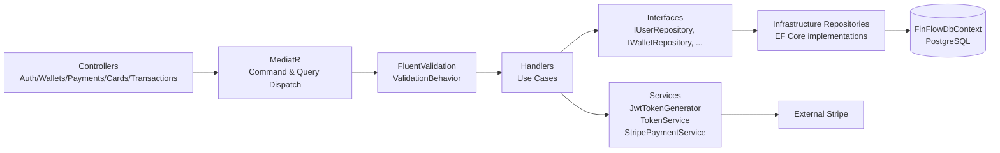
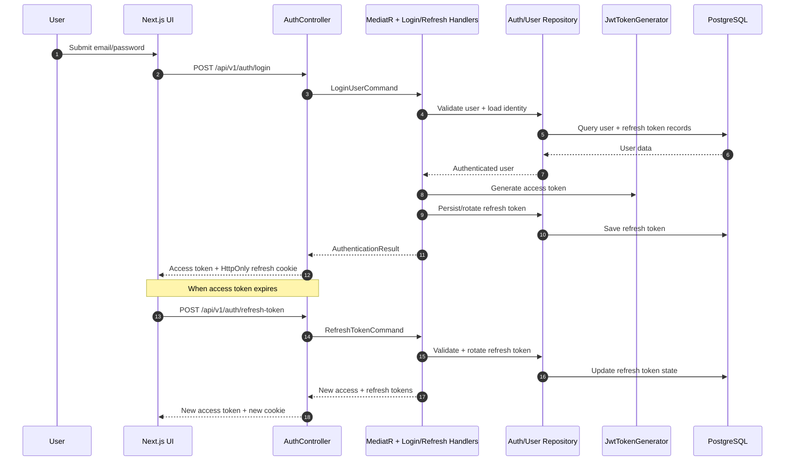
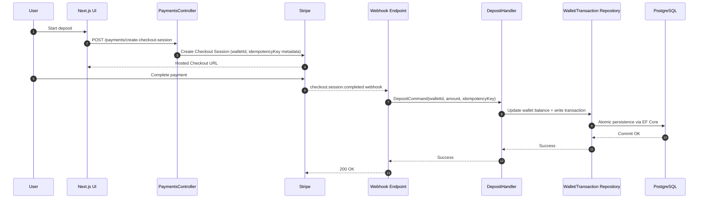
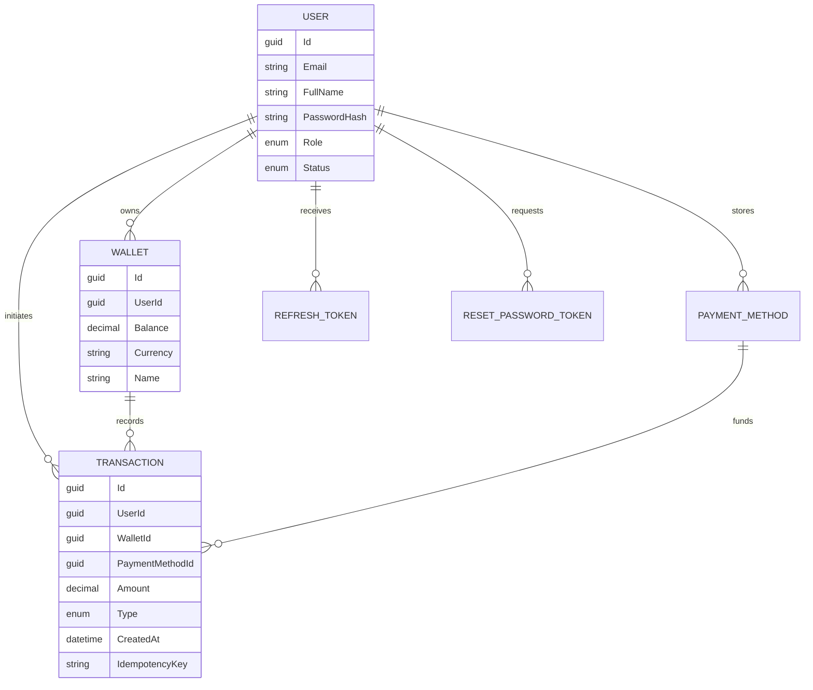
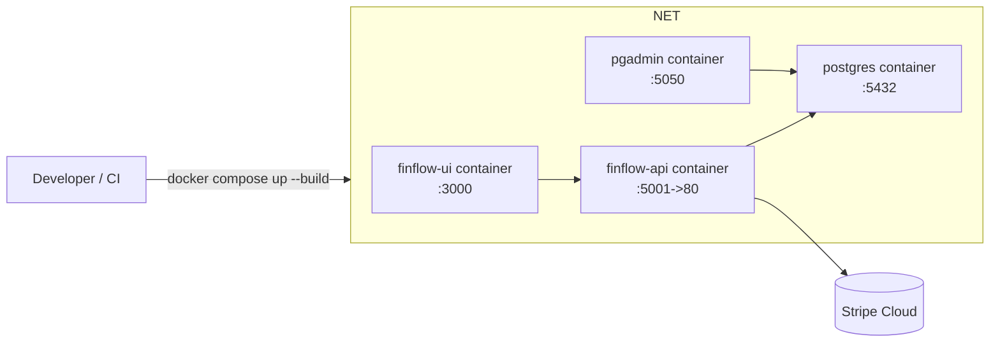

# FinFlow System Design Diagram

This document maps the runtime architecture of **FinFlow** across client, API, application, infrastructure, and external providers.

## 1) High-Level Container Diagram

```mermaid
flowchart TB
    U[End User\nBrowser / Mobile] --> UI[Next.js 14 UI\nfinflow-ui]

    subgraph Docker Network (finflow-net)
      UI -->|HTTPS/JSON\nJWT + Cookies| API[FinFlow.API\nASP.NET Core 9]
      API --> APP[FinFlow.Application\nCQRS + MediatR + Validators]
      APP --> INF[FinFlow.Infrastructure\nRepositories + EF Core + Stripe Services]
      INF --> DB[(PostgreSQL 15\nfinflowdb)]
      PG[pgAdmin] --> DB
    end

    API <-->|Payment Intents / Checkout / Webhooks| STRIPE[Stripe API]
    API --> LOGS[Console/File Logs\n(+ Seq when configured)]
```

---

## 2) Backend Layered Design (Clean Architecture)



---

## 3) Authentication & Token Flow



---

## 4) Wallet Funding via Stripe Webhook (Event-Driven)



---

## 5) Runtime Cross-Cutting Concerns

```mermaid
flowchart TB
    Req[Incoming HTTP Request]
    FWD[Forwarded Headers]
    EX[Global Exception Middleware\nstandard error payload]
    CORS[CORS Policy\nFRONTEND_URLS]
    RL[Rate Limiter Policies\nAuthSensitive / Payments / StripeWebhook]
    AUTH[JWT Authentication & Authorization]
    CTRL[API Controllers]
    LOG[Serilog\nConsole + File (+ Seq optional)]

    Req --> FWD --> EX --> CORS --> RL --> AUTH --> CTRL
    CTRL --> LOG
    EX --> LOG
```

---

## 6) Data Model (Core Domain)



---

## 7) Deployment View



