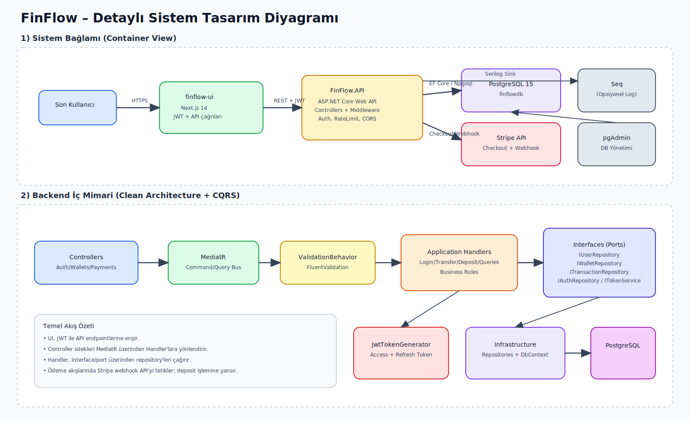
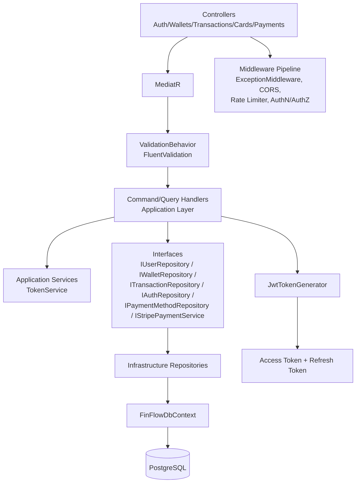
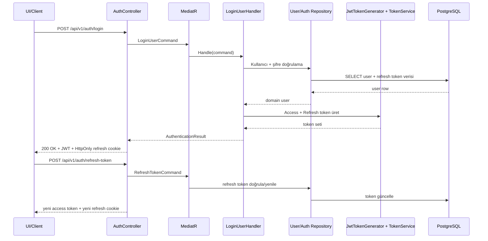
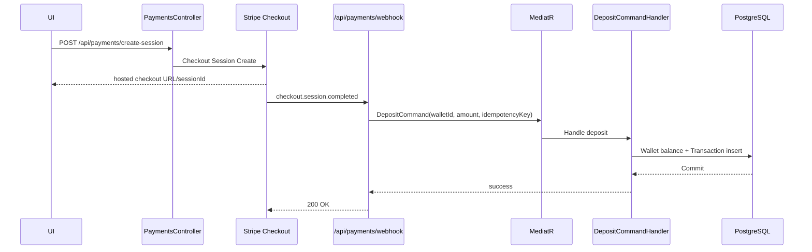

# FinFlow Detaylı Sistem Tasarım Diyagramı

Bu doküman, FinFlow projesinin uçtan uca mimarisini (istemci, API katmanları, veri katmanı, dış servisler ve temel iş akışları) tek yerde gösterir.

## Görsel Diyagram (SVG)

Aşağıdaki görsel, sistemin yüksek seviyeli bileşenlerini ve backend iç akışını tek diyagramda birleştirir:



---

## 1) Konteyner / Sistem Bağlamı Diyagramı

```mermaid
flowchart LR
    U[Son Kullanıcı] -->|HTTPS| UI[finflow-ui\nNext.js 14]
    UI -->|REST + JWT| API[FinFlow.API\nASP.NET Core Web API]
    API -->|EF Core / Npgsql| DB[(PostgreSQL 15\nfinflowdb)]
    API -->|Ödeme oturumu + webhook doğrulama| STRIPE[Stripe API]
    API -->|Yapılandırılmış loglar| SEQ[Seq \(opsiyonel\)]
    DEV[Developer/Ops] -->|DB yönetimi| PGADMIN[pgAdmin]
    PGADMIN --> DB

    subgraph Docker Compose Ağı (finflow-net)
        UI
        API
        DB
        PGADMIN
    end
```

## 2) Backend İç Katmanlar (Clean Architecture + CQRS)



## 3) Kimlik Doğrulama ve Token Yaşam Döngüsü



## 4) Ödeme ve Bakiye Güncelleme (Stripe Webhook)



## 5) Operasyonel ve Güvenlik Notları

- API girişinde JWT Bearer doğrulaması vardır; CORS yalnızca `FRONTEND_URLS` ile sınırlandırılır.
- Kritik endpoint gruplarında oran sınırlama (AuthSensitive / Payments / StripeWebhook) uygulanır.
- Tüm istekler exception middleware ve Serilog ile gözlemlenebilir hale getirilir.
- API versiyonlama (`v1`) ve Swagger/OpenAPI üzerinden sözleşme görünürlüğü sağlanır.
